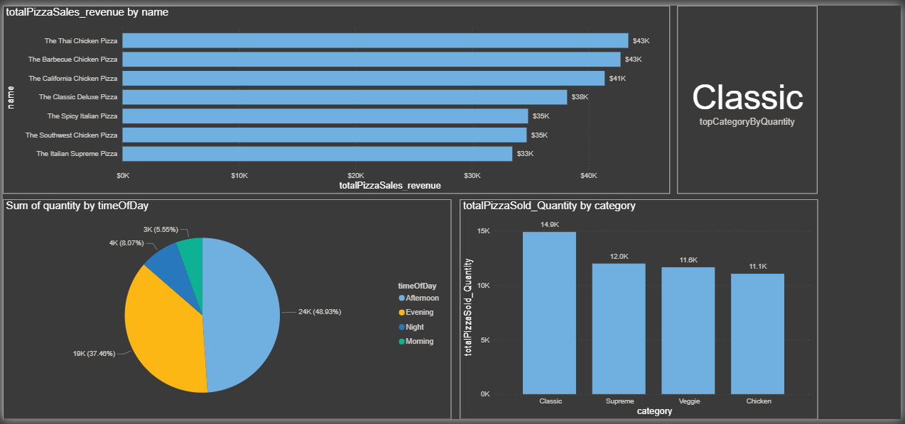

# 📌 SALES-ANALYTICS-PORTFOLIO
End-to-end BI project analyzing pizza sales trends, product performance, and peak hours using Python, SQL, Excel and Power BI. Sales analysis of pizza orders using SQL(Extraction), Python(Pandas, Seaborn, Plotly), Excel(Cleaning) and Power BI for dashboarding.

This project analyzes sales data for a pizza restaurant to identify opportunities for revenue growth. The analysis covers 40,000+ records to determine key performance indicators (KPIs) and operational trends.

**Tools Used:** SQL, Python (Pandas, Plotly), Power BI, Excel.

## 📊 Key Insights
- **Revenue:** The store generated **$817,860** in total revenue.
- **Peak Times:** The busiest days are **Fridays**, particularly between **12 PM - 1 PM** and **6 PM - 8 PM**.
- **Best Sellers:** The "Thai Chicken Pizza" contributes the highest revenue, while "Brie Carre" is the lowest performing.
- **Customer Behavior:** The Average Order Value (AOV) is **$38.31**.

## 📂 Files in this Repository
- **`Pizza Sales Analysis (Dashboard).pbix`**: The interactive Power BI Dashboard.
- **`SALES ANALYSIS NOTEBOOK.ipynb`**: Python code for data cleaning and EDA.
- **`Sales Analysis (BRD).pdf`**: The detailed Business Requirements Document (BRD).

## 📷 Dashboard Screenshots

## 🚀 Conclusion
Based on the analysis, I recommended optimizing inventory for the "Classic" category and running promotional offers during weekdays to balance the sales distribution.
